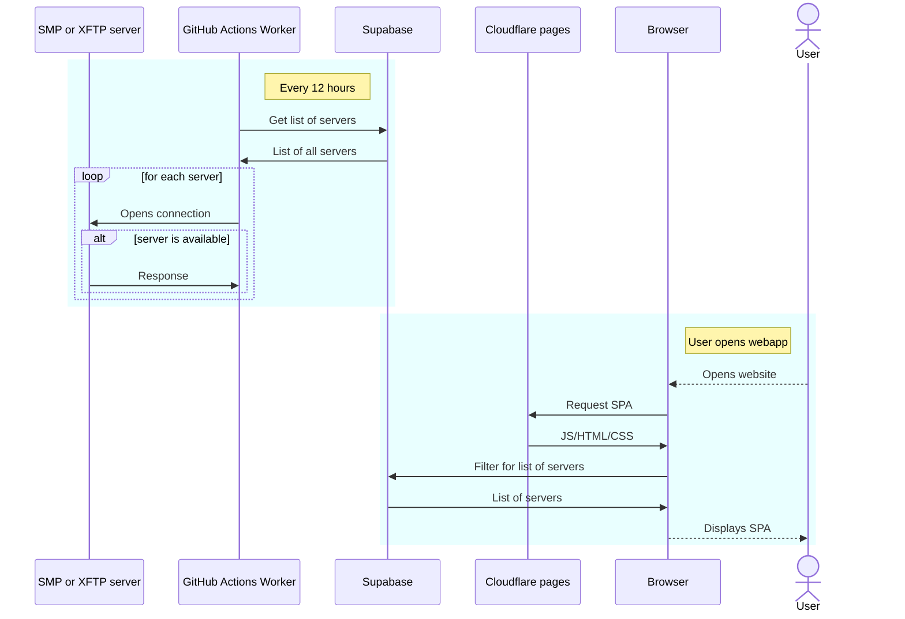

# SimpleX Unofficial Directory Frontend [](https://github.com/ed-asriyan/simplex-directory-frontend/actions/workflows/CD.yml)
Web application built on Svelte.js and Supabase for https://simplex-directory.asriyan.me

# Architecture
This repository is one of components. The entire project works on the following:
* **Supabase** project that stores list of all added SimpleX servers and availability statuses. Code: [simplex-directory-supabase](https://github.com/ed-asriyan/simplex-directory-supabase)
* **GitHub Actions Worker** running the app what validates SMP servers and updates date in Supabase. Code: [simplex-directory-servers-validator](https://github.com/ed-asriyan/simplex-directory-servers-validator)
* **Cloudlare** serving SPA app. Code is this repository



# Setup
## Init
1. Setup [simplex-directory-supabase](https://github.com/ed-asriyan/simplex-directory-supabase) locally or in cloud. This is backend service for the frontend app
2. *(optional)* Setup [Google Analytics](https://analytics.google.com)
3. *(optional)* Setup [Sentry](https://sentry.io) account and create Svelte project
4. Create `ENV_FILE_CONTENT` repository variable and copy content of filled by you [.env](.env) file in it

## Local development
1. Install docker
2. Install dependencies:
   ```console
   make dev_install
   ```

Now you can run the dev server locally:
```console
make dev_serve
```

## Generate prod bundle
```console
make prod_build_bundle
```

## GitHub Actions
* Each push to `master` triggers deployment to production
* Make sure that `ENV_FILE_CONTENT` repository variable is filled
